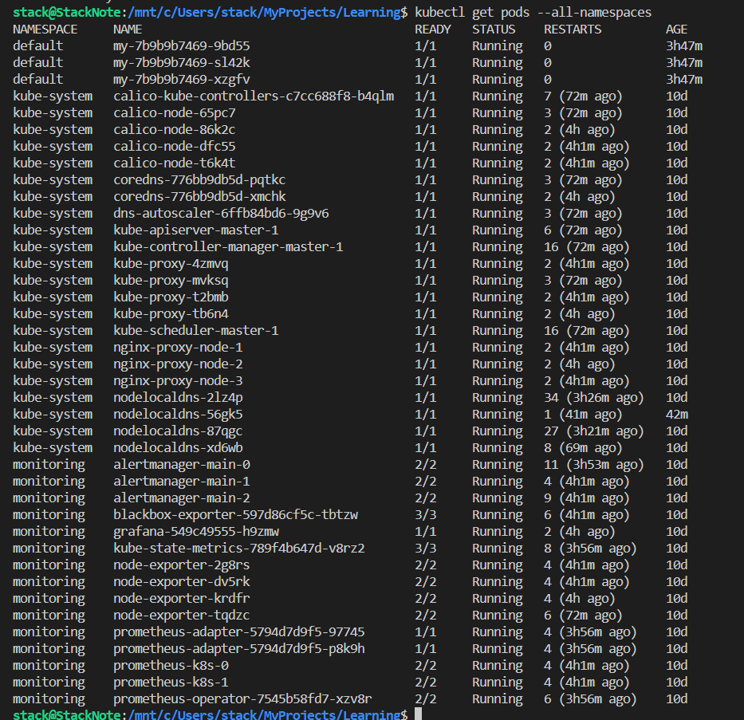
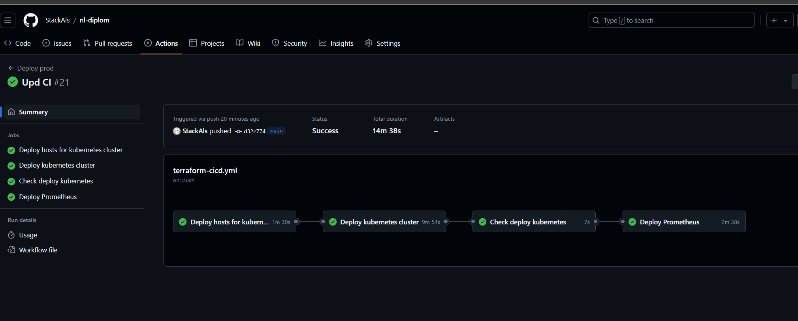
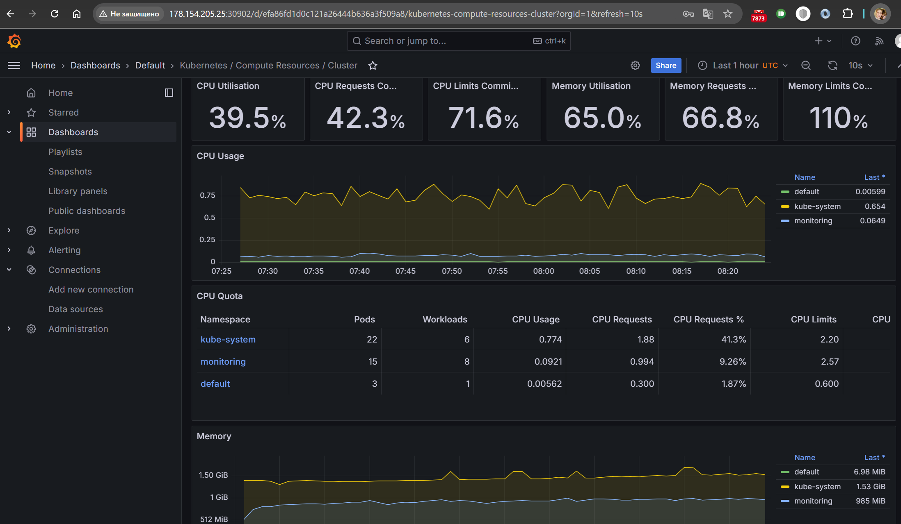
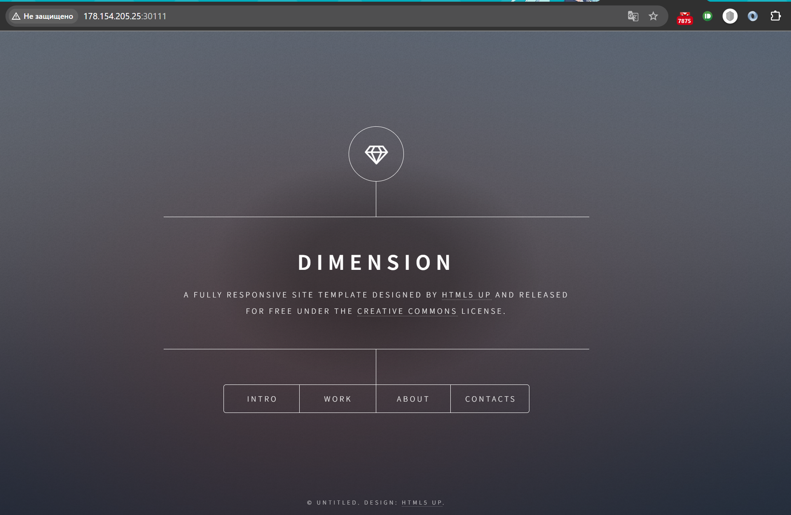
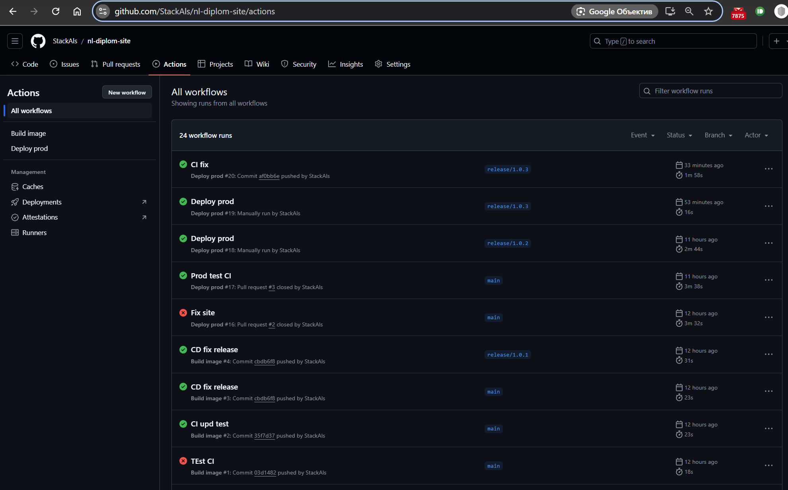
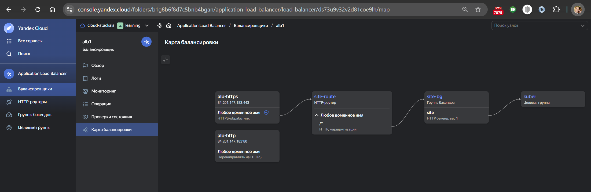
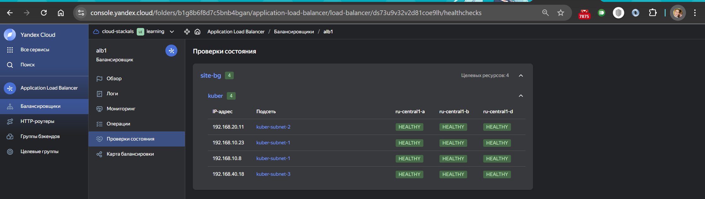
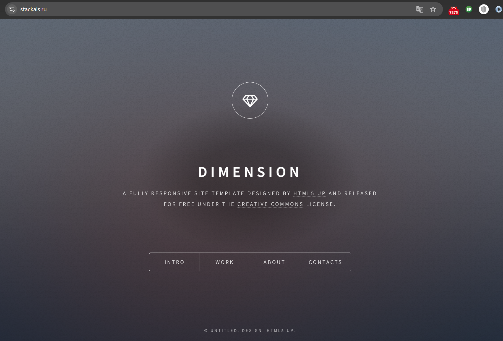

# Дипломная работа

---

## Цели

1. Подготовить облачную инфраструктуру на базе облачного провайдера Яндекс.Облако.
2. Запустить и сконфигурировать Kubernetes кластер.
3. Установить и настроить систему мониторинга.
4. Настроить и автоматизировать сборку тестового приложения с использованием Docker-контейнеров.
5. Настроить CI для автоматической сборки и тестирования.
6. Настроить CD для автоматического развёртывания приложения.

## Предварительная подготовка

1. Создайте сервисный аккаунт, который будет в дальнейшем использоваться Terraform для работы с инфраструктурой с необходимыми и достаточными правами. Не стоит использовать права суперпользователя

2. Подготовьте [backend](https://www.terraform.io/docs/language/settings/backends/index.html) для Terraform:  
   а. Рекомендуемый вариант: S3 bucket в созданном ЯО аккаунте(создание бакета через TF)

3. Создайте VPC с подсетями в разных зонах доступности.

---

Создал пользователя terraform для дальнейшего взаимодействия с облаком по документации
[https://yandex.cloud/ru/docs/tutorials/infrastructure-management/terraform-quickstart]

[Код в папке terraform-init](./terraform-init/)

Чтобы создание/удаление инфраструктуры kubernetes не влияло на хранение состояния terraform в бакете, я отделил код создания бакета для terraform и код создания регистри для хранения образов Docker от кода создания кластера Kubernetes.
Для первоначальной инициализации инфраструктуры работы с terraform (хранения состояния в бакете на S3) создаю сервисный аккаунт s3admin и бакет stackals-tfm-bkt (файлы tf-backet*). Так же создаю сервисный аккаунт sa-registry и registry для хранения Docker образов (файлы registry*).

   Создаю бакет stackals-tfm-bkt и произвожу инициализацию - состояние terraform хранится в stackals.tfstate. (Для Kubernetes в project.tfstate)

   ```bash
   terraform init -backend-config="access_key=$ACCESS_KEY" -backend-config="secret_key=$SECRET_KEY"
   terraform plan 
   terraform apply -auto-approve
   ```

Теперь создаю инфраструктуру для kubernetes

   [Код в папке kuber-init](./kuber-init/)

Сети [vpc.tf](./kuber-init/vpc.tf) и [vpc_var.tf](./kuber-init/vpc_var.tf)

---

## Создание Kubernetes кластера

[Код в папке kuber-init](./kuber-init/)

На этом этапе необходимо создать Kubernetes кластер на базе предварительно созданной инфраструктуры. Требуется обеспечить доступ к ресурсам из Интернета.

Это можно сделать двумя способами:

1. Рекомендуемый вариант: самостоятельная установка Kubernetes кластера.  
   а. При помощи Terraform подготовить как минимум 3 виртуальных машины Compute Cloud для создания Kubernetes-кластера. Тип виртуальной машины следует выбрать самостоятельно с учётом требовании к производительности и стоимости. Если в дальнейшем поймете, что необходимо сменить тип инстанса, используйте Terraform для внесения изменений.  
   б. Подготовить [ansible](https://www.ansible.com/) конфигурации, можно воспользоваться, например [Kubespray](https://kubernetes.io/docs/setup/production-environment/tools/kubespray/)  
   в. Задеплоить Kubernetes на подготовленные ранее инстансы, в случае нехватки каких-либо ресурсов вы всегда можете создать их при помощи Terraform.

---

   Создаю ВМ для развертывания kubernetes и применяю kubespray, через ansible.

   [kuber.tf](./kuber-init/kuber.tf) и [kuber_var.tf](./kuber-init/kuber_var.tf)

   Для инвентори ansible используется шаблон [templates/inventory.tftpl](./kuber-init/templates/inventory.tftpl)

   Создал скрипт подготовки инфраструктуры ansible, выполнения playbook и запуска на готовом кластере стека kubernetes-prometheus <https://github.com/prometheus-operator/kube-prometheus> (Prometheus, Grafana, Alertmanager) для мониторинга кластера [ansible/kubespray.sh](./kuber-init/ansible/kubespray.sh) Благодаря ему Terraform сконфигурирован и создание инфраструктуры посредством Terraform возможно без дополнительных ручных действий.

   Во время исполнения playbook по пути ansible/kubespray/inventory/cluster/artifacts/admin.conf выгружается конфиг для подключения к кластеру - его и использую дальше в скрипте для настройки стека kubernetes-prometheus (Prometheus, Grafana, Alertmanager).

---

1. Работоспособный Kubernetes кластер.
2. В файле `~/.kube/config` находятся данные для доступа к кластеру.
3. Команда `kubectl get pods --all-namespaces` отрабатывает без ошибок.



При ручном изменении сертификата для доступа kubectl к кластеру необходимо выполнить:

```bash
# Добавление в сертификат внешнего IP
# https://blog.scottlowe.org/2019/07/30/adding-a-name-to-kubernetes-api-server-certificate/
# https://kubernetes.io/docs/tasks/administer-cluster/kubeadm/kubeadm-reconfigure/

# считываю текущую конфигурацию и меняю доступные в сертификате IP
# sudo kubectl edit configmap -n kube-system kubeadm-config
# sudo kubectl -n kube-system get configmap kubeadm-config -o yaml
sudo nano /etc/kubernetes/kubeadm-config.yaml
# удаляю текущие сертификаты
mkdir ~/kubernetes/
sudo mv /etc/kubernetes/pki/apiserver.{crt,key} ~/kubernetes/
sudo kubeadm init phase certs apiserver --config /etc/kubernetes/kubeadm-config.yaml
# restart apiserver - через его удаление - автоматическое создание кластером
sudo crictl pods | grep kube-apiserver | cut -d' ' -f1
# id заменить на свой
sudo crictl stopp 5c688d6c476dd
sudo crictl rmp 5c688d6c476dd

# тест
sudo kubeadm init phase upload-config kubeadm --config /etc/kubernetes/kubeadm-config.yaml
# copy admin.conf
mkdir ~/.kube
sudo cp /etc/kubernetes/admin.conf ~/.kube/config
sudo chown $USER ~/.kube/config
```

---

Так же, при необходимости, возможна вручную установка стека для мониторинга <https://github.com/prometheus-operator/kube-prometheus> . В целом всё устанавливается по README и можно использовать настройки по умолчанию. Но тогда снаружи не будет доступен. Необходимо включить использование NodePorts.
В таком случае проект собирается так

```shell

# install GO last version - official instruction https://go.dev/doc/install
rm -rf /usr/local/go && tar -C /usr/local -xzf go1.23.0.linux-amd64.tar.gz
export PATH=$PATH:/usr/local/go/bin
export GOPATH=$HOME/go

# install jb, gojsontoyaml, jsonnet
go install -a github.com/jsonnet-bundler/jsonnet-bundler/cmd/jb@latest
go install github.com/brancz/gojsontoyaml@latest
go install github.com/google/go-jsonnet/cmd/jsonnet@latest

# create custom
mkdir my-kube-prometheus; cd my-kube-prometheus
jb init  # Creates the initial/empty `jsonnetfile.json`
# Install the kube-prometheus dependency
jb install github.com/prometheus-operator/kube-prometheus/jsonnet/kube-prometheus@main # Creates `vendor/` & `jsonnetfile.lock.json`, and fills in `jsonnetfile.json`

wget https://raw.githubusercontent.com/prometheus-operator/kube-prometheus/main/example.jsonnet -O example.jsonnet
wget https://raw.githubusercontent.com/prometheus-operator/kube-prometheus/main/build.sh -O build.sh
chmod +x build.sh

# uncomment in example.jsonnet - add node-ports
#// (import 'kube-prometheus/addons/node-ports.libsonnet') +
./build.sh
```

В скрипте [ansible/kubespray.sh](./kuber-init/ansible/kubespray.sh) это закомментировано для более быстрой сборки кластера (кластер пересоздавал несколько раз - отрабатывал различные конфигурации, поэтому необходимости устанавливать, уже установленное в первый запуск, на локальной машине нет)

После сборки конфигурации стека - установка стека мониторинга кластера - тоже по README

```shell
# Create the namespace and CRDs, and then wait for them to be available before creating the remaining resources
# Note that due to some CRD size we are using kubectl server-side apply feature which is generally available since kubernetes 1.22.
# If you are using previous kubernetes versions this feature may not be available and you would need to use kubectl create instead.
kubectl apply --server-side -f manifests/setup
kubectl wait \
 --for condition=Established \
 --all CustomResourceDefinition \
 --namespace=monitoring
kubectl apply -f manifests/
```

## Подготовка cистемы мониторинга и деплой кластера Kubernetes через CI/CD

Для автоматического деплоя kubernetes кластера и разворачивания на нём стека системы мониторинга создал CI/CD пайплайн

[.github/workflows](./.github/workflows/)

Файл terraform-init-s3.yml - отвечает за первоначальную настройку бакета хранящего состояния terraform. Запускается вручную - т.к. его установка и настройка необходима один раз.

Файл terraform-cicd.yml - непосредственно автоматический пайплайн для ветки main. Запускает terraform и затем выполняет настройку и установку kubernetes кластера с помощью kubespray. Далее делает установку стека Prometheus.

Посмотреть выполнение пайплайнов можно здесь [Actions](https://github.com/StackAls/nl-diplom/actions)



### Тестирование работоспособности мониторинга

```bash
## Prometheus
kubectl --namespace monitoring port-forward svc/prometheus-k8s 9090
# Open Prometheus on [http://localhost:9090](http://localhost:9090) in your browser.
# Check out the [alerts](http://localhost:9090/alerts) and [rules](http://localhost:9090/rules) 

## Grafana
kubectl --namespace monitoring port-forward svc/grafana 3000
# Open Grafana on [localhost:3000](http://localhost:3000) in your browser.
# You can login with the username `admin` and password `admin`.

## Alertmanager
kubectl --namespace monitoring port-forward svc/alertmanager-main 9093
# Open Alertmanager on [localhost:9093](http://localhost:9093) in your browser.
```



---

## Создание тестового приложения

Для перехода к следующему этапу необходимо подготовить тестовое приложение, эмулирующее основное приложение разрабатываемое вашей компанией.

Способ подготовки:

1. Рекомендуемый вариант:  
   а. Создайте отдельный git репозиторий с простым nginx конфигом, который будет отдавать статические данные.  
   б. Подготовьте Dockerfile для создания образа приложения.  
2. Альтернативный вариант:  
   а. Используйте любой другой код, главное, чтобы был самостоятельно создан Dockerfile.

Ожидаемый результат:

1. Git репозиторий с тестовым приложением и Dockerfile.
2. Регистри с собранным docker image. В качестве регистри может быть DockerHub или [Yandex Container Registry](https://cloud.yandex.ru/services/container-registry), созданный также с помощью terraform.

## Установка и настройка CI/CD приложения

Осталось настроить ci/cd систему для автоматической сборки docker image и деплоя приложения при изменении кода.

Цель:

1. Автоматическая сборка docker образа при коммите в репозиторий с тестовым приложением.
2. Автоматический деплой нового docker образа.

Можно использовать [teamcity](https://www.jetbrains.com/ru-ru/teamcity/), [jenkins](https://www.jenkins.io/), [GitLab CI](https://about.gitlab.com/stages-devops-lifecycle/continuous-integration/) или GitHub Actions.

Ожидаемый результат:

1. Интерфейс ci/cd сервиса доступен по http.
2. При любом коммите в репозиторие с тестовым приложением происходит сборка и отправка в регистр Docker образа.
3. При создании тега (например, v1.0.0) происходит сборка и отправка с соответствующим label в регистри, а также деплой соответствующего Docker образа в кластер Kubernetes.

---

За основу взят проект <https://github.com/cloudacademy/static-website-example>

Приложение с [Dockerfile](https://github.com/StackAls/nl-diplom-site/blob/main/Dockerfile) и настроенным пайплайном [github actions](https://github.com/StackAls/nl-diplom-site/blob/main/.github/workflows/myapp-cicd.yml) находится здесь
<https://github.com/StackAls/nl-diplom-site>

[Деплой приложения в kubernetes](./app/myapp) и [его сервис](./app/myapp/myservice.yml)

Для пайплайна в секреты добавлен доступ к регистри YandexCloud.

В кластере kubernetes так же добавлен секрет для доступа к регистри и установлен раннер master-1 для запуска пайплайна.

```bash
# add auth secret
kubectl create secret docker-registry regcred --docker-server=cr.yandex --docker-username=oauth --docker-password=$OAUTH

# add runner for server
mkdir actions-runner && cd actions-runner
curl -o actions-runner-linux-x64-2.319.1.tar.gz -L https://github.com/actions/runner/releases/download/v2.319.1/actions-runner-linux-x64-2.319.1.tar.gz

```

Пайплайн собирает приложение в image на предоставляемом github раннере ubuntu-latest.

Затем деплоится на kubernetes.

---





Дополнительно настроил ALB. При входе на <https://stackals.ru/> трафик перераспределяется по подам, на которых развернуто приложение.
Сертификат создан в Certificate Manager от LetsEncrypt и прикручен к ALB.






